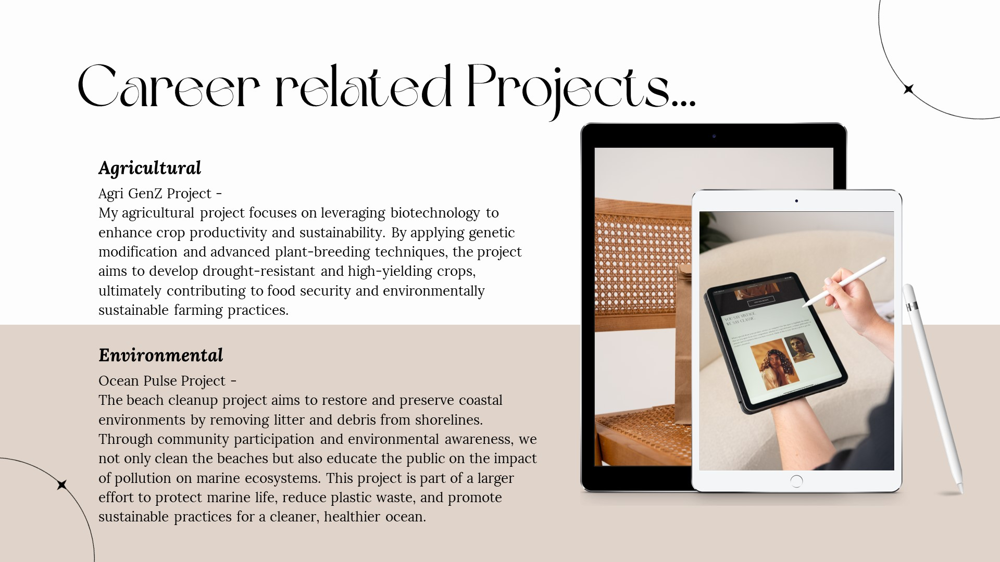
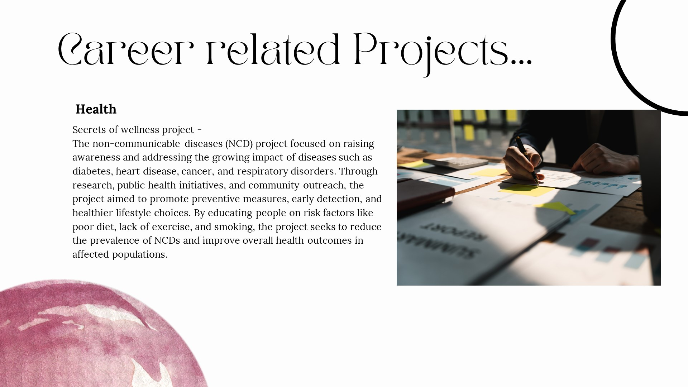
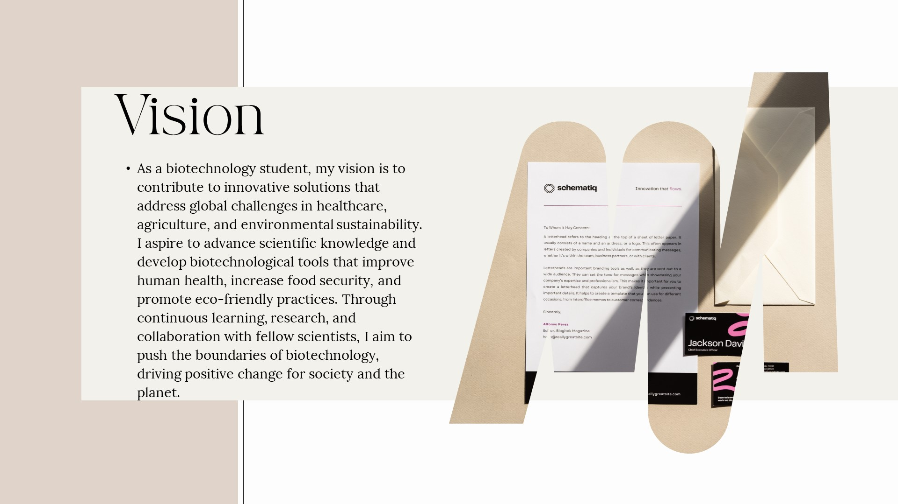
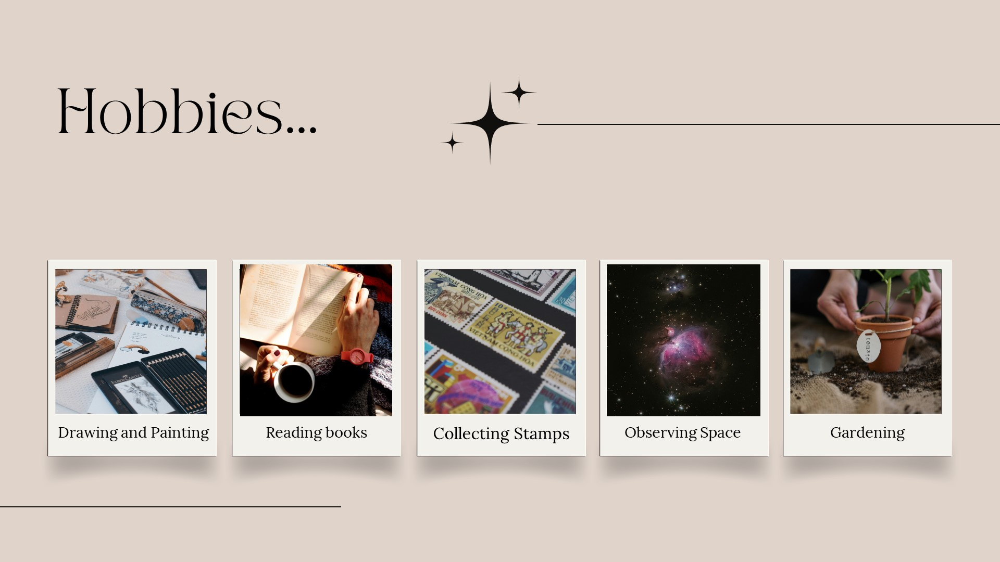
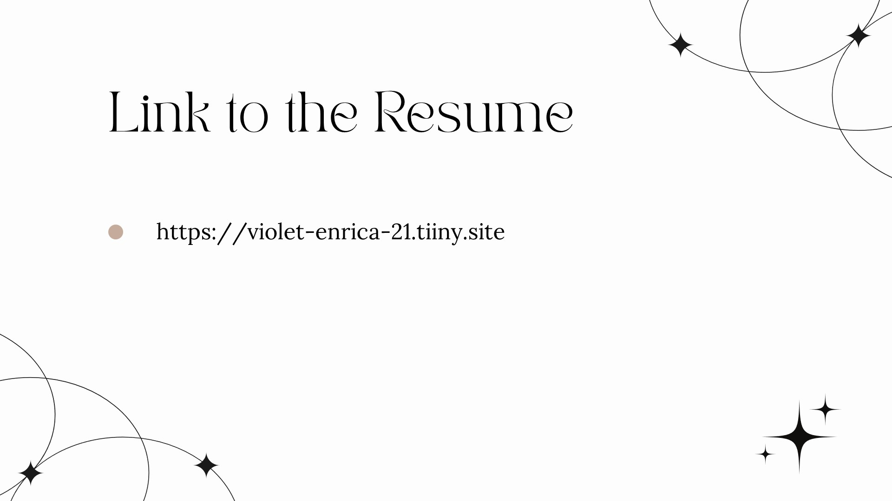

<!DOCTYPE html>
<html lang="en">
<head>
    <meta charset="UTF-8">
    <meta name="viewport" content="width=device-width, initial-scale=1.0">
    <title>Image Slideshow</title>
</head>
<body>
     
     
     
     
     
     
     
     
     
     
     
    
<section id="resume">
        

            <h2>Resume</h2>
            
You can view and download my resume below:

            <a href="HS24510097_Lakna Janavie Manimel Wadu.pdf" download="HS24510097_Lakna Janavie Manimel Wadu.pdf" class="btn">Download Resume</a>
        

    
</section>  
</body>
</html>
