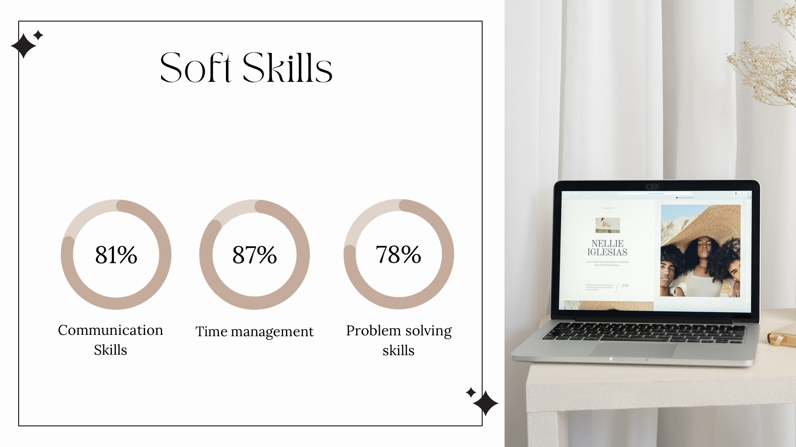

<!DOCTYPE html>
<html lang="en">
<head>
    <meta charset="UTF-8">
    <meta name="viewport" content="width=device-width, initial-scale=1.0">
    <title>Image Slideshow</title>
    
</head>
<body>

    

        

            
        

        

            
        

        

            
        

        

            
        

        

            
        

        

            
        

        

            
        

        

            
        

        

            
        

        

            
        

        

            
        

        <!-- Next and previous buttons -->
        <a class="prev" onclick="plusSlides(-1)">&#10094;</a>
        <a class="next" onclick="plusSlides(1)">&#10095;</a>
    

    <section id="resume" class="resume-container">
        

            <h2>Resume</h2>
            
You can view and download my resume below:

            <a href="HS24510097_Lakna Janavie Manimel Wadu.pdf" download="HS24510097_Lakna Janavie Manimel Wadu.pdf" class="btn">Download Resume</a>
        

    </section>

    <script>
        let slideIndex = 0;
        showSlides();

        function showSlides() {
            let i;
            let slides = document.getElementsByClassName("slides");
            for (i = 0; i < slides.length; i++) {
                slides[i].style.display = "none";
            }
            slideIndex++;
            if (slideIndex > slides.length) {slideIndex = 1}
            slides[slideIndex-1].style.display = "block";
            setTimeout(showSlides, 3000);
